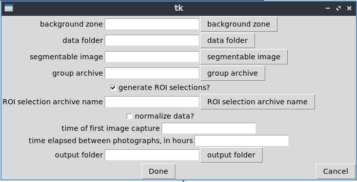
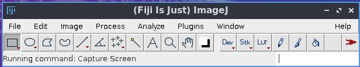
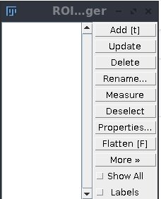

# Luciferase Pipeline Usage Guide

The luciferase pipeline, also known as AutoLuc, is a tool to automate the analysis of sequences of photographs of trans-genic luciferase-expressing *Arabidopsis* plants. Its useage is intended to accelerate research on circadian rhythms in *Arabidopsis*.
It uses 16-bit gray-scale images as its primary input.

## User Interface

The user interface for AutoLuc is in essence, a form where the user specifies the information about what is to analyzed. When the user is satified with their choices, they click the button labeled "Done", and from there the pipeline executes with no further interation, eventually outputting graphs and spreadsheets into a folder for examination and further analysis.

The inputs labeled "background zone", "data folder", "segmentable image", "group archive",
"ROI selection archive name", and "output folder" all take different kinds of files as input.
These files are represented by their filenames, which can be selected using the button on the right of these input parameters.

### Types of Files

The kinds of files that the pipeline is concerned with are images, directories, ROI objects, and zip archives that specifically contain ROI objects.

*Images* are files that use an array of numbers to represent a depiction of an object or area. 

*Directories* are files that contain other files; Directories are also known as folders.

*ROI objects* represent a geometric shape at some location. They are created with ImageJ to designate an area of an image as being significant in some way. ROI objects have the file extension .roi.

*Zip archives* are files that are like directories in that they contain other files, but unlike directories in that they store files in less space by using compression. This means that zip files are considered individual files that generally have to be decompressed before their contents can be accessed, although this varies based on the available software tools. The zip archives that the pipeline uses only contain ROI objects, and they are also created with ImageJ.

### File Input

For parameters that require a file, the general pattern is that the name of the parameter is in a label on the left, a button that launches a selector tool is positioned on the right, and a text entry that displays the filename once selected or typed in is in the middle.

### Background Zone

The parameter labeled "background zone" requires an ROI object file, which has a .roi extension. This ROI object is used to measure and graph a region of the data set that is not part of population of plants in the experiment. The idea is that having that background region measured is a useful point of comparison. For example, it might allow us to assert the absence of a contaminating light source.

### Data Folder

The parameter labeled "data folder" requires a directory containing the data set, which should be a numbered sequence of 16-bit gray-scale images depicting a population of plants over time.

### Segmentable Image

The parameter labeled "segmentable image" requires an image depicting the same population of plants from the data set, from the same viewing angle, from the same distance, and ideally the same camera. This image must also be in 16-bit gray-scale. One of the simpler ways to fill this parameter is to use the first image from the data set.

### Group Archive

The parameter labeled "group archive" requires a zip archive of ROI objects. It is intended that this archive was created by the operator to identify the locations of each experimental group in the data set.

### ROI Selections

The two parameters with ROI in their names are related.

If the box for "generate ROI selections?" is checked, then the program will use the image from the "segmentable image" parameter to automatically locate the objects in the data set, which are the plants that are supposed to be measured and analyzed, along with any other area of sufficient brightness, which are generally the reflections of the light emissions of the plants off of the petri dishes they are grown in. The generated ROI objects will then be saved to the chosen archive file name from the parameter "ROI selection archive name", as well as being used to measure and analyze the data set.

If the box for "generate ROI selections?" is **not** checked, then the program will attempt to load ROI objects from the archive file name selected in "ROI selection archive name", and use those for measurement and analysis. If the file chosen does not exist or is otherwise unsuitable, the program will crash.

The behavior of the file selector for "ROI selection archive name" depends on the value for the checkbox "generate ROI selections?". If the checkbox is &#9745; checked, then the file selector will be a "Save As" dialog. Otherwise, the file selector will be a "Select" or "Open" dialog.

### Normalize Data

If the parameter "normalize data?" is enabled, then the values for each plant and group will be divided by their maximum value, thus measuring their luminance relative to their own maximum luminance. If this parameter is left disabled, then the values will be left in their original units, and unnormalized.

### Initial and Elapsed Time

The parameter "time of first image capture" is for the operator to insert the time, and if necessary date at which the first photo in the data set was taken. This argument is used as a string to label the x-axis, so it can include arbitrary text.

The parameter "time elapsed between photographs, in hours" is used to ensure the numerical labels on the x-axis indicate the amount of elapsed time since the data started being gathered. This input must be numerical, and it must be positive. Both integers and decimal numbers are acceptable, fractions and inclusions of unit names will cause the program to crash. This parameter should be the number of hours that were elapsed between each image in the data set being taken. Incidentally, this assumes that the time between photographs is constant during the data set.

### Output Folder

The parameter "output folder" takes a directory, and saves the output to the directory selected. Not selecting a folder here will cause the program to crash.

## Creating ROI Objects and Zip Archives Thereof

Creating ROI objects is necessary for creating a background zone ROI object and creating a Zip archive with the different experimental groups for a given experiment/analysis. Creating these is done in ImageJ, and uses the same image that can be used for the parameter "segmentable image". The first step is to open ImageJ, ideally of the Fiji variety. Whether you use an ImageJ that is installed on your computer or the ImageJ that was installed by the luciferase pipeline is immaterial.

The next thing to do is to open the Roi Manager tool. It can be found through the menus via `Analyze` &#8594; `Tools` &#8594; `Roi Manager...` or through the search bar. In either case, the Roi Manager will have a series of buttons down its right and a blank space for ROI objects on the left.

The third step is to open the image for the paramter "segmentable image". Whatever you do, make sure you do not *permanently* modify this image. It will mess with the results if you do so. You will however need to modify it *temporarily*. Either do not save the changed image, or find a way to make it so that the changes will not propogate to the original, perhaps my making a duplicate of the image and closing the original.

The fourth step is to run the "Enhance Contrast..." command on the image. Doing so makes the location of the plants in the image easier to see. Using the "Equalize Histogram" option in particular can make relatively dim plants much more easily visible.

### Singular ROI Object

Use one of the ImageJ tools to make a selection, then add it to the Roi Manager using the "Add" button on the right, or the "t" key on the keyboard.

Select the ROI object on the Roi Manager by left clicking it.

Click the "More>" button on the right.

Click the "Save As" button in the menu that appears.

Save the ROI object as a file with a .roi extension. The dialog may add the .roi extension automatically.

You can use this .roi file for the parameter "background zone" if you so choose.

### Archive with multiple ROI Objects

For each area you want to include in the archive, use the ImageJ tools to create a selection, then add it to the Roi Manager by using the "Add" button on the right side of the Roi Manager, or the "t" key on the keyboard.

Ensure that none of the ROI objects in the ROI Manager are selected.

Click the "More>" button on the right.

Click the "Save AS" button in the menu that appears.

Save the list of ROI objects as an archive with a .zip extension. The dialog may add the .zip extension automatically.

You can use this .zip file for the paramter "group archive" if you so choose.
This archive can also be used for the parameter "ROI selection archive name" if you choose not to auto-generate ROI objects for the plants.

## Done and Cancel Buttons

If the "Cancel" button is clicked, the pipeline halts immediately and does not proceed.

If the "Done" button is clicked, the pipeline uses the selected parameters and attempts to run its analysis.

If the user interface is terminated by other means, the pipeline will most likely attempt to run, and then crash.

